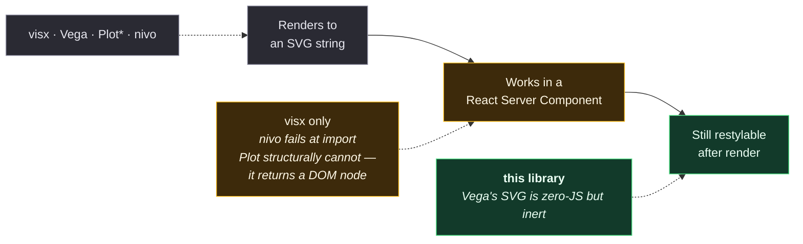

# 013 — The zero-JS claim, narrowed

**Status:** ✅ **applied** 2026-08-23 · verified 2026-08-23
**Applied to:** `PRODUCT.md` (Positioning reordered, ladder now leads), `../00-decisions.md`,
`../01-plain-english.md`, `../raw/03-landscape-charting.md` (the four empirical results recorded).
Decision 7's own row was left as written, as this record instructs.
**Affects:** `PRODUCT.md`, `../00-decisions.md` decision 7's Consequence column, any public positioning
**Does not affect:** decision 7 or 8 themselves — the architecture is unchanged

---

## Context

Decision 7's consequence column states:

> *"Zero of the 11 charting libraries audited ship a `"use client"` directive; every consumer must
> author their own boundary. This is a first-paint story no competitor currently matches."*

That is accurate. But it had hardened in conversation into something much stronger and much weaker:
*"none of the eleven can render server-side with zero JS."* That version is false, and it is the sort
of false that gets caught in the first comparison blog post — which `../00-decisions.md` already warns
against in the "claim that survives scrutiny" section.

---

## Evidence

Four libraries were tested **empirically** — installed locally, rendered, output inspected. Not read
from documentation.

| Library | Renders server-side? | Works inside an RSC? | Evidence |
|---|---|---|---|
| **visx** | Yes — with `typeof document === "undefined"` | **Yes** | Next 15 static export built; full geometry in the HTML; **124 B** page JS; zero visx/d3 bytes in any client chunk |
| **Vega** | Yes — no DOM at all | n/a (not React) | `view.toSVG()` in bare Node → 7,459 B, real geometry, `<text>` labels |
| **Observable Plot** | Yes — but **needs a DOM** | No — returns a DOM node | Bare Node: `TypeError: … reading 'documentElement'`. With jsdom: 2,126 B, `<path d="M40,130L126.667,80.5L213.333,106.167L300,20"` |
| **Nivo** | Yes (React SSR) | **No — fails at import** | `TypeError: x.createContext is not a function` during "Collecting page data" |

**The nivo result was controlled.** An identical page file with **only `'use client'` added** builds
successfully — same React 19, same nivo 0.87. The failure is the server-component boundary, not a
version incompatibility. Cost of the working version: `/nivo` ships **89.6 kB** page JS / 192 kB first
load, with nivo in client chunk `462-f186577f89077c20.js`. The visx page ships **124 B** and nothing
in any chunk.

⚠ One methodological note, because it changes how much the nivo number is worth: the install needed
`--legacy-peer-deps` (nivo 0.87's peer range is `>= 16.14.0 < 19.0.0`, the app is React 19). The first
attempt produced `Module not found: Can't resolve '@nivo/line'`, which is an install failure, not a
result — that run was discarded rather than reported.

---

## Decision

**Retire** *"none of the eleven can render server-side with zero JS."*

**Two narrower claims survive, and both are load-bearing:**

### 1. RSC-native without a wrapper is rare

Server-side SVG is table stakes. Rendering inside a React Server Component is not:

\* Plot renders server-side only with a DOM shim; it cannot work in an RSC at all.

### 2. Server-rendered **and still restylable** is rarer still

Vega's `toSVG()` output is genuinely zero-JS — and completely inert. It bakes presentation into
attributes, so nothing about it can be changed from a stylesheet after render. That is the gap
decision 4 fills, and it is the one place where the CSS-theming story and the zero-JS story compound
rather than merely coexist.

### The wording to use

> **The first planned, size-adaptive chart library that renders with zero JS and stays themeable after
> render.**

Every word is doing work: *planned* and *size-adaptive* exclude visx (hook-free primitives, but no
planner, no ladder, no size-awareness — and `@visx/responsive` is unambiguously client-side); *zero
JS* excludes nivo; *themeable after render* excludes Vega.

⚠ State the carve-out with it. `../41-text-metrics.md` §2 establishes six text-measurement properties
that are plan inputs, not CSS-only — so "themeable from CSS" is true of presentation and *not* true of
anything that changes glyph advances. Claiming otherwise reintroduces the hydration-mismatch path that
[`../maps/03-token-flow.md`](../maps/03-token-flow.md) forbids.

---

## Consequences

- **The ladder becomes the headline, not the theming.** This inverts earlier positioning advice and is
  the practical output of this record. CSS theming is now the *weakest* of the three claims —
  Highcharts already does most of it (see [014](014-highcharts-styled-mode-correction.md)) and it is
  further constrained by [012](012-no-line-element-for-tokened-geometry.md). The size ladder is
  untouched by any of this and remains the only claim with **no credible prior art in a shipping
  library** — `raw/06` §7 found that only Carbon and Spectrum do anything with size and both only
  rescale.
- **Decision 7's own wording is fine and should not be touched.** "Zero of the 11 ship a `"use client"`
  directive" was verified true and is a different, defensible statement.
- **visx's near-miss is worth stating publicly rather than hiding.** `@visx/shape@3.5.0`'s `LinePath`
  is `React.createElement("path", …)` around d3-shape math, zero hooks, no `"use client"` — it would
  render in an RSC today. Acknowledging that costs nothing and buys credibility for the claims that
  do hold; pretending otherwise invites exactly the correction this record is making.

---

## Amendments required elsewhere

| File | Change |
|---|---|
| `PRODUCT.md` | Replace any "no library can render server-side" phrasing with the narrowed claim; lead with the ladder |
| `../00-decisions.md` | Leave decision 7's row **as written** — it is correct. Add the narrowed claim to "The claim that survives scrutiny" |
| `raw/03-landscape-charting.md` | Record the four empirical results, so the next reader does not re-derive them |

---

## What would overturn this

Any of: nivo shipping RSC compatibility; Observable Plot gaining a string-returning renderer; a new
entrant shipping a size-adaptive planner. The third is the only one that touches the *ladder* claim,
which is why the ladder is the safest thing to lead with.

**Re-run the four tests before any public launch.** They took under an hour and they are the difference
between a claim that holds and a claim that gets corrected in someone else's blog post. This is a
fast-moving field and the result has a shelf life.
