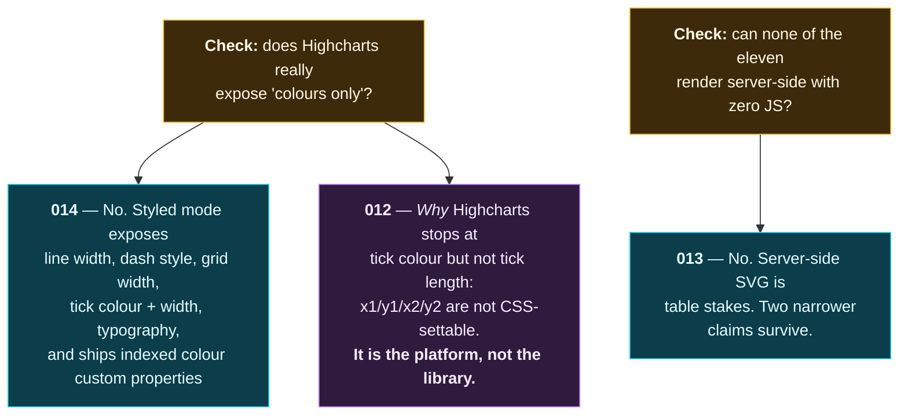

# `decisions/` — decision register

Decisions **1–11 live in [`../00-decisions.md`](../00-decisions.md)** and are indexed here, not
copied. There is one authoritative statement of each decision and this folder is not it — a second
copy would drift, and a drifted decision record is worse than none because it carries the same
authority.

From **012 onward**, each decision gets its own file. The change of format is not cosmetic: 1–11 were
settled together on 2026-08-22 as a coherent set, so a table is the right shape for them. Everything
since arrives one at a time, in response to a specific finding, and needs room for the evidence that
forced it.

---

## Index

| # | Decision | Where | Status |
|---|---|---|---|
| 1 | Distribution — open source, npm, scoped packages | `../00-decisions.md` | locked 2026-08-22 |
| 2 | Library boundary — presentational only | `../00-decisions.md` | locked 2026-08-22 |
| 3 | Grid model — 12 columns × unlimited rows | `../00-decisions.md` | locked 2026-08-22 |
| 4 | Theming — CSS custom properties + TS token types | `../00-decisions.md` | locked 2026-08-22 |
| 5 | Chart core — raw d3 primitives, own SVG tree | `../00-decisions.md` | locked 2026-08-22 |
| 6 | Grid engine — `react-grid-layout@2/core` | `../00-decisions.md` | locked 2026-08-22 |
| 7 | Render boundary — two entry points, one render tree | `../00-decisions.md` | locked 2026-08-22 |
| 8 | Plan is data — pure `planChart()` | `../00-decisions.md` | locked 2026-08-22 |
| 9 | Build — `tsdown` + `unbundle: true`, ESM-only, TS 6.0.3 | `../00-decisions.md` | locked 2026-08-22 |
| 10 | No DOM measurement in the resolver | `../00-decisions.md` | locked 2026-08-22 |
| 11 | Test stack — bare Node, injected fake RO, happy-dom banned | `../00-decisions.md` | locked 2026-08-22 |
| 012 | [No `<line>` element for anything a token must control](012-no-line-element-for-tokened-geometry.md) | this folder | ✅ **applied** |
| 013 | [The zero-JS claim, narrowed](013-zero-js-claim-narrowed.md) | this folder | ✅ **applied** |
| 014 | [Highcharts styled mode — correcting "colours only"](014-highcharts-styled-mode-correction.md) | this folder | ✅ **applied** |
| 015 | [The token gate parses CSS; it does not grep it](015-token-gate-is-a-parser.md) | this folder | ✅ **applied** |

**012–014 were applied on 2026-08-23**, in a separate, explicit act after they were written — which
is the point of the two-step. Each record's Status line now names the files it landed in, and each
*Amendments required* table remains as the checklist it was verified against.

Two follow-ons deliberately did **not** land with them:

- **012's per-token element column** waits for the token tree at **B1**; the *rule* is in
  `20-architecture.md` and the *gate* (**G14**) is in the register, which is what protects A4.
- **013's four empirical tests must be re-run before any public launch.** They took under an hour and
  they have a shelf life; a positioning claim verified in August 2026 is not verified in 2027.

`raw/06` §7 and the surrounding survey text were **left as written** and given a correction banner
instead. Raw files are the record of what a research pass found — overwriting them hides that the
finding was ever wrong, which is the thing worth remembering.

---

## Why these three exist at all

**012–014** came out of one verification pass, and they are related in a way worth stating: **two competitive
claims were checked, both came back weaker than written, and chasing the reason for one of them
surfaced a platform constraint that matters more than either.**

012 is the one with a deadline. 013 and 014 change what we *say*; 012 changes what we *emit*, and
discovering it at B1 — with thirty tokens mysteriously inert — costs a rewrite of the render tree.

**015 came from the same habit applied to our own work rather than to competitors.** A1 was declared
unblocked; the claim was audited instead of repeated, and the audit found the token lint gate described
as a *port* of a script nobody had opened. Opening it — then **running** it — showed it rejects valid CSS
four times in six and passes `oklch()`, which is the notation `DESIGN.md` derives the entire palette in.

Worth noticing what the three earlier records have in common with it: **012, 013 and 015 are all the
same species — a thing that looks like it works and quietly doesn't.** A geometry token that parses and
does nothing. A positioning claim that reads as verified and was not tested. A gate that exits 0 because
it never opened the files it exists for. The register is mostly a list of those.

---

## Format

Each file carries, in order: **Status** · **Context** (what was believed) · **Evidence** (what was
checked, and how) · **Decision** · **Consequences** · **Amendments required elsewhere** · **What would
overturn this**.

The last section is not decoration. `../00-decisions.md` already establishes that a verified source is
*a strong prior, not an authority* — Adobe Spectrum demonstrably scales stroke width down at small
sizes and we reject it anyway. A decision record that cannot say what would change its mind is an
assertion wearing a record's clothes.

---

## Related

Flow maps live in [`../maps/`](../maps/). The maps show *what the structure is*; these records say
*why it is that and not something else*. Where a map carries a ⚠ marker, it points here.
