# Map 00 — System map

Source: `../20-architecture.md` §2, §5.3. Arrows read **"depends on"**.

---

## The package graph

```mermaid
graph TD
    subgraph pure["No React · No DOM · isomorphic"]
        core["<b>@gx/core</b><br/>planChart · resolveSizeClass<br/>measureText · scales · ticks"]
    end

    subgraph rsc["RSC-safe · hook-free"]
        prim["<b>@gx/primitives</b><br/>&lt;Chart plan={...}&gt;<br/>Axis · Grid · LinePath · Labels"]
    end

    subgraph client["&quot;use client&quot; · per file"]
        react["<b>@gx/react</b><br/>&lt;AutoChart&gt; · useElementSize<br/>tooltip · crosshair · brush"]
        grid["<b>@gx/grid</b><br/>12-col widget shell"]
    end

    tokens["<b>@gx/tokens</b><br/>CSS custom properties<br/>+ generated TS types<br/><i>deps: none</i>"]
    testing["<b>@gx/testing</b><br/>FakeResizeObserver + emit&#40;&#41;<br/>plan snapshots · a11y matchers"]

    d3["d3-scale · d3-shape · d3-array<br/>d3-format · d3-time-format"]
    rgl["react-grid-layout@2<br/><i>./core subpath</i>"]

    core --> d3
    prim --> core
    react --> prim
    grid --> react
    grid --> rgl
    testing --> core
    prim -.->|"consumes at paint time,<br/>not as a code dependency"| tokens

    classDef pureC fill:#0b3d4a,stroke:#22d3ee,color:#e6fbff
    classDef rscC fill:#123a2a,stroke:#4ade80,color:#eafff3
    classDef clientC fill:#3d2a0b,stroke:#fbbf24,color:#fff8e6
    classDef extC fill:#2a2a33,stroke:#8b8b9e,color:#e8e8f0,stroke-dasharray:4 3
    class core pureC
    class prim rscC
    class react,grid clientC
    class d3,rgl extC
```

The **colour bands are the boundary that matters**, not the boxes. Cyan may not import React. Green
may not use state, effects, or refs. Amber is the only place a client runtime exists, and it is
declared per file, not per package (`../20-architecture.md` §5.2).

---

## The rules the graph enforces

Each is mechanically checked, not conventional. The right-hand column is what breaks if the rule is
dropped — which is the only reason any of them are worth the enforcement cost.

| Rule | Enforced by | What breaks without it |
|---|---|---|
| `@gx/core` may not import `react` | dependency-cruiser rule (A1) | The resolver stops being usable from Node, a worker, or another framework — and the "plan is data" claim becomes unfalsifiable |
| `@gx/core` may not call `getComputedTextLength`, `getBBox`, `getTotalLength`, `getBoundingClientRect` | lint rule + bare-Node test tier | The server path dies, **and** the ladder becomes untestable — jsdom throws on all four, happy-dom returns `0` |
| `@gx/primitives` may not import `react-dom` or use state/effects/refs | dependency-cruiser + RSC fixture build | The RSC path silently degrades to SSR-plus-hydration |
| Only `@gx/react` and `@gx/grid` carry `"use client"` | grep on built output in CI | One stray directive marks server-safe modules as client and destroys the whole decision-7 story |
| No package emits a raw hex/rgb/hsl or `px` literal in CSS | token lint gate, **both directions** | Token discipline is unrecoverable once lost; a gate never observed to fail is a job that exits 0 |
| ⚠ No `<line>` element for anything a token must control | see [`../decisions/012`](../decisions/012-no-line-element-for-tokened-geometry.md) | Tick-length and gridline-extent tokens compile, ship, and do nothing |

Allowed hooks in `@gx/primitives` are exactly `useMemo`, `useCallback`, `useId` — verified present in
React 19's `react-server` build (`../20-architecture.md` §2).

---

## Why there is no `@gx/charts-*` package per chart type

It was in the original sketch. Per-type packages fragment the plan resolver, which needs a single
switch over `ChartType` to stay coherent. The replacement is **subpath exports** on one
`@gx/primitives` — `/line`, `/bar`, `/donut` — so tree-shaking still gives per-type granularity
without per-type versioning.

That trade is only safe because it is measured: the tree-shaking CI gate (§6e) asserts that importing
one chart ships one chart. Revisit only if that gate's numbers say otherwise.

---

## Packaging shape, per package

| Package | `"use client"` | `sideEffects` | Note |
|---|---|---|---|
| `@gx/tokens` | no | `["*.css"]` | Ships a stylesheet; no runtime JS |
| `@gx/core` | no | **`false`** | Strict `false` is meaningful here and should be enforced |
| `@gx/primitives` | **no** | `["*.css"]` | Subpath exports per chart type |
| `@gx/react` | **yes, per file** | `["*.css"]` | Directive on each client entry |
| `@gx/grid` | **yes, per file** | `["*.css"]` | Must supply the directive `react-grid-layout@2` lacks |
| `@gx/testing` | no | `false` | Dev-facing |

⚠ `sideEffects: ["*.css"]` rather than `false` is the one place strictness is a bug — `false` tells
bundlers a bare `import './chart.css'` is droppable and the styles silently vanish.
