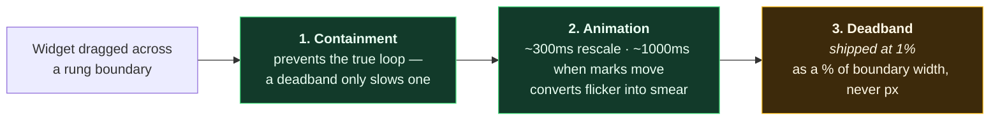

# Map 01 — Runtime flow

Source: `../20-architecture.md` §1, §3; `../00-decisions.md` §7–8; `../40-chart-plan.md` §1.3, §5.

---

## The whole library in one line

```
size + dataShape + policy + overrides ──▶ planChart() ──▶ ChartPlan ──▶ <Chart> ──▶ SVG
         (serialisable inputs)             (pure)         (data)       (hook-free)
```

Everything below is that line with its failure modes drawn in.

---

## The two entry points

One resolver, one render tree, two ways in. This is decision 7 resolved by decision 8 — the reason
adaptation and zero-JS are not in conflict.

```mermaid
flowchart TD
    subgraph server["STATIC PATH — React Server Component, zero JS"]
        s1["Caller knows the size<br/><i>report · PDF · email · fixed slot</i>"]
        s2["planChart&#40;type, ctx, shape, policy, overrides&#41;"]
        s3["ChartPlan<br/><i>plain · serialisable</i>"]
        s4["&lt;Chart plan={...}&gt;"]
        s5["SVG in the HTML response"]
        s1 --> s2 --> s3 --> s4 --> s5
    end

    subgraph clientp["ADAPTIVE PATH — &quot;use client&quot;"]
        c1["&lt;AutoChart&gt; mounts"]
        c2["useElementSize&#40;&#41;<br/>ResizeObserver · contentBoxSize · rAF-batched"]
        c3["SizeContext<br/><i>width · height · cols · rows · aspect · sizeClass</i>"]
        c4["planChart&#40;&#41; — <b>the same function</b>"]
        c5["ChartPlan"]
        c6["&lt;Chart plan={...}&gt; — <b>the same component</b>"]
        c7["SVG, re-rendered on rung change"]
        c1 --> c2 --> c3 --> c4 --> c5 --> c6 --> c7
        c7 -.->|"resize"| c2
    end

    s2 -.->|"SSR emits a plan for a declared<br/>initial size, so first paint is correct<br/>and does not flash"| c1

    classDef sv fill:#123a2a,stroke:#4ade80,color:#eafff3
    classDef cl fill:#3d2a0b,stroke:#fbbf24,color:#fff8e6
    class s1,s2,s3,s4,s5 sv
    class c1,c2,c3,c4,c5,c6,c7 cl
```



**No duplicated chart code exists anywhere in this diagram.** `planChart()` and `<Chart>` appear
twice because they are called twice, not because there are two of them. If a future change makes the
two paths call different code, decision 7 is broken regardless of what the tests say.

---

## Inside `planChart()` — order is load-bearing

The resolver is **single-pass and must stay that way** (`../40-chart-plan.md` §1.3). There is a
near-cycle in the layout maths, and it is only not a cycle because the order is fixed:

```mermaid
flowchart LR
    a["y-tick label widths"] --> b["y-axis gutter"]
    b --> c["plot width"]
    c --> d["x tick count<br/><i>max&#40;2, round&#40;width/100&#41;&#41;</i>"]
    d --> e["x label degrade<br/><i>abbreviate → split → rotate → transpose</i>"]
    e -.->|"❌ FORBIDDEN<br/>would require a fixpoint,<br/>and a fixpoint inside a<br/>ResizeObserver callback<br/>is the loop error"| b

    classDef ok fill:#0b3d4a,stroke:#22d3ee,color:#e6fbff
    class a,b,c,d,e ok
    linkStyle 4 stroke:#f87171,stroke-width:2px,stroke-dasharray:5 4
```



**Degradation affects only the axis it degrades.** That sentence is the entire reason one pass is
sufficient.

---

## Where policy and overrides apply

They were one argument at seed time and are now two, because they apply at **different times**. The
distinction is not cosmetic: `aggregateAfter` as policy is a threshold the resolver consults, and as
an override it is a decided value the resolver is forbidden to revise.


Full precedence, highest wins — modelled on Vega-Lite's `config` cascade:

1. library defaults
2. theme-level — `<GxConfig charts={{ line: { … } }}>`
3. per-chart props — `<Chart plan={{ legend: { placement: 'absent' } }}>`
4. `planFn` — `<Chart planFn={(p, ctx) => …}>`

`planFn` is last so an escape hatch can always see and amend the **fully resolved** plan.

✅ The shorthand `legend: 'hidden'` was stale twice over — `'hidden'` is a visibility, not a
placement, and it named the one behaviour the Conceal Means Gone rule bans. Both occurrences
(`../20-architecture.md:109`, `../10-responsive-ladder.md:52`) now read
`legend: { placement: 'absent' }`, each with a note recording why the shorthand was wrong rather
than silently replacing it.

---

## The three forbidden edges

Each of these is a path someone will reach for, that compiles, and that fails silently.

```mermaid
flowchart TD
    css["CSS custom property<br/>--gx-*"]
    dom["DOM measurement<br/>getBBox · getComputedTextLength<br/>getTotalLength · getBoundingClientRect"]
    sib["Sibling / content-determined size"]
    resolver(("planChart&#40;&#41;"))
    box["The measured box"]

    css -.->|"❌ getComputedStyle exists only in a browser.<br/>Server plan ≠ client plan =<br/><b>hydration mismatch on every chart</b>"| resolver
    dom -.->|"❌ jsdom throws · happy-dom returns 0.<br/>Zero silently means <b>every label fits</b>,<br/>so collision tests pass forever"| resolver
    resolver -.->|"❌ A plan field that changes the<br/>measured box is an <b>infinite<br/>ResizeObserver loop</b>"| sib
    sib -.-> box
    box --> resolver

    classDef bad fill:#3a1518,stroke:#f87171,color:#ffe8e8
    classDef ok fill:#0b3d4a,stroke:#22d3ee,color:#e6fbff
    class css,dom,sib bad
    class resolver,box ok
```



**The containment invariant, stated positively** (`../40-chart-plan.md` §1.3):

> Every `ChartPlan` field describes a subdivision of, or an element inside, the measured box.
> **No field names an outer dimension.** There is no `width`, no `height`, no widget margin.

Two fields look like violations and are not:

| Field | Reads as | Actually means |
|---|---|---|
| `legend.placement: 'external'` | outside the widget | outside the **plot area**, inside the measured box — it shrinks the plot, never grows the box |
| `dataTable` expansion | pushes the figure taller | the disclosure lives **inside** the measured element and scrolls within it |

---

## What absorbs a rung change

The plan remains pure and `prevClass` is settled **out** of the resolver (`../40-chart-plan.md` §9).
The live client boundary now passes the previous class into a pure 1% fractional deadband
classifier, after containment has ruled out true layout cycles:



The 1000ms bound is **A-lit and A-impl at once** — Heer & Robertson 2007 measured it and Adobe
Spectrum ships `DRAW_IN_ANIMATION_DURATION_MS = 1000`, arrived at independently. Cite both.

⚠ There is deliberately **no `motion.enabled` field**. `prefers-reduced-motion` is a CSS media query
the server cannot read; a resolver field derived from it would produce one plan on the server and
another on the client. The plan carries the structural facts; CSS decides whether the transition runs,
via `@media (prefers-reduced-motion: no-preference)` — note the polarity, animation is *added* when
no preference is expressed.
