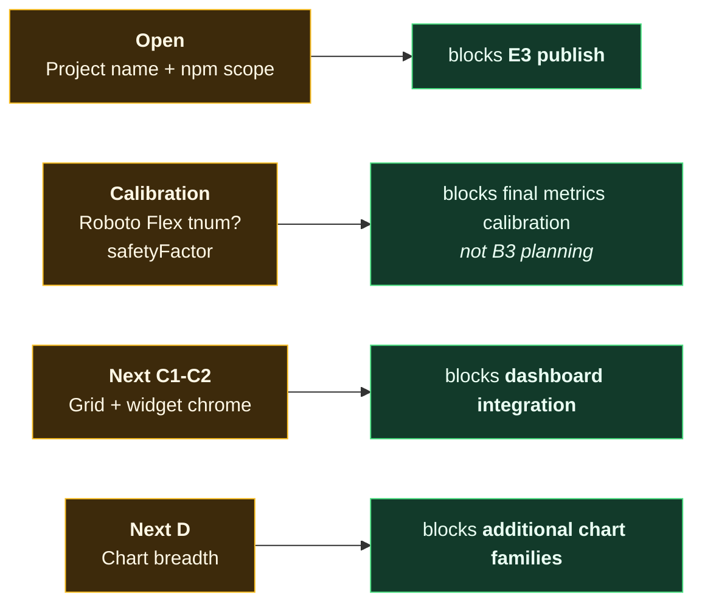
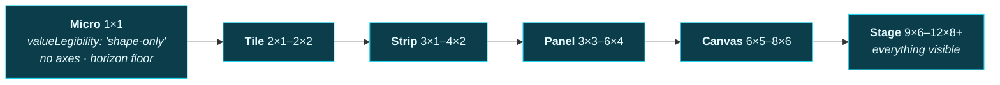

# Map 02 — Implementation flow

Source: `../30-implementation-plan.md` (all milestones + the sequencing-risks table); `../README.md`
"Open" list. Arrows read **"must land before"**.

---

## The milestone DAG

```mermaid
flowchart TD
    A1["<b>A1</b> Repo foundation<br/><i>pnpm · Turborepo · tsdown unbundle<br/>TS 6.0.3 · dependency-cruiser</i>"]
    A2["<b>A2</b> @gx/core types<br/><i>ChartPlan · SizeContext<br/>resolveSizeClass · measureText</i>"]
    A3["<b>A3</b> planChart&#40;&#41; — line + area<br/><i>all six rungs</i>"]
    A4["<b>A4</b> @gx/primitives<br/><i>&lt;Chart&gt; · RSC fixture build</i>"]
    A5["<b>A5</b> @gx/react &lt;AutoChart&gt;<br/><i>useElementSize · ResizeObserver</i>"]
    A6["<b>A6</b> Transitions<br/><i>rescale ~300ms · replace ~1000ms</i>"]

    B1["<b>B1</b> Token tree<br/><i>186 declarations · generated CSS + TS</i>"]
    B2["<b>B2</b> Prove-we-exceed<br/><i>the restyle demo</i>"]
    B3["<b>B3</b> Threshold policy<br/><i>typed inputs · provenance + consumption gate</i>"]

    C1["<b>C1</b> @gx/grid<br/><i>react-grid-layout@2/core</i>"]
    C2["<b>C2</b> Widget chrome<br/><i>header · menu · empty · error</i>"]

    D["<b>D</b> Chart breadth<br/><i>bar → donut → KPI → scatter<br/>→ heatmap → funnel/progress/sparkline</i>"]

    E1["<b>E1</b> Fumadocs site"]
    E2["<b>E2</b> Responsive-semantics page<br/><i>the ladder, live</i>"]
    E3["<b>E3</b> Release<br/><i>Changesets · OIDC · pkg.pr.new</i>"]

    A1 --> A2 --> A3 --> A4 --> A5 --> A6
    A1 --> B1 --> B3
    B1 --> B2
    A4 --> B2
    A3 --> B3
    A5 --> C1 --> C2
    A6 --> D
    B3 --> D
    D --> E2
    A4 --> E1 --> E2 --> E3
    C2 --> E3

    classDef a fill:#0b3d4a,stroke:#22d3ee,color:#e6fbff
    classDef b fill:#123a2a,stroke:#4ade80,color:#eafff3
    classDef c fill:#3d2a0b,stroke:#fbbf24,color:#fff8e6
    classDef d fill:#2f1b3d,stroke:#c084fc,color:#f6ecff
    classDef e fill:#2a2a33,stroke:#8b8b9e,color:#e8e8f0
    class A1,A2,A3,A4,A5,A6 a
    class B1,B2,B3 b
    class C1,C2 c
    class D d
    class E1,E2,E3 e
```

**The A-spine is strictly serial and the B-track is not.** B1 forks off A1, not off A6 — the token
tree needs a repo and a build, nothing more. Anyone who waits for the charts before starting tokens
has invented a dependency that does not exist and lost several days to it.

---

## Current sequencing

A1-A6 and B1-B3 are complete for the current line/area planner. The remaining work is downstream
integration and release preparation; none of it requires reopening the B3 policy contract.

The old Open 2/3/5 entries were B1 transcription items. B1's generated source, membership gate,
naming gate, Neutral themes, and census now close that work; the historical risk remains in the
research record, but it is no longer a current blocker.

---

## The order inside A3, and why it is that order

A3 is the milestone most likely to be attempted in the wrong order, because the tempting order is
"easy rungs first". The correct order is **most-constrained first**:

Build **Micro first, Stage last.** Stage is the rung where every field is present and nothing has to
be given up, so it teaches nothing about the resolver. Micro is where the plot-height thresholds, the
`valueLegibility` honesty field, and the substitute-the-mark behaviour all fire at once. If Micro
works, the rest are subtractions from Stage toward a target that already exists.

Two non-obvious behaviours that must be in A3 and not deferred:

| Behaviour | Why it cannot wait |
|---|---|
| **Below the 24px plot-height floor, substitute the mark** — a `replace`, not a `rescale` | It is the one transition that changes what is drawn, so it decides the A6 animation contract. Discovering it at A6 means reopening A3. |
| **Legend is non-monotonic** — externalise going *up*, internalise-or-add going *down* | `LegendPlan` is a discriminated union precisely because of this. Model it as a boolean at A3 and every rung above Panel is wrong. |

---

## Sequencing risks, as a decision aid

`../30-implementation-plan.md` carries nine of these in a table. The three that change *what you do
this week*, rather than what you watch for:

| Risk | The tell | The move |
|---|---|---|
| `"use client"` stripped by the bundler | A5 builds fine, and the directive is missing from `dist/` | Grep built output in CI **at A1**, not at A5. `unbundle: true` is the only config where it survives on a non-entry file — verify it the day the build exists. |
| Test harness lies about text width | Collision tests pass at every rung, including ones that visibly collide | happy-dom returns `0` from every SVG measurement API. **Banned, in `A1`'s config, before a single test is written.** |
| Token gate never fires | Green CI, drifting values | Gate must be tested **in both directions** — a job that has never failed is indistinguishable from a job that exits 0 unconditionally. |

---

## Where each CI gate first lands

Full detail in [`04-ci-gate-map.md`](04-ci-gate-map.md). The point of this column is that gates are
milestone deliverables, not a cleanup pass before release:

| Milestone | Gate that first appears |
|---|---|
| A1 | dependency direction · `"use client"` survival · no-DOM-API lint · happy-dom ban |
| A3 | ladder snapshots · `valueLegibility !== 'values' → !axes.y.visible` |
| A4 | RSC fixture builds · tree-shaking size assertion |
| A5 | `FakeResizeObserver` rung transitions |
| B1 | token lint, **both directions** |
| B3 | every live threshold is typed, serialisable, tiered, and consumed by the planner; reserved future thresholds are explicitly marked `@future` |
| E3 | provenance published · OIDC publish · pkg.pr.new preview |
