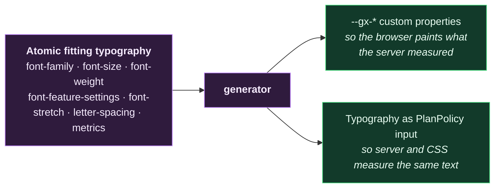
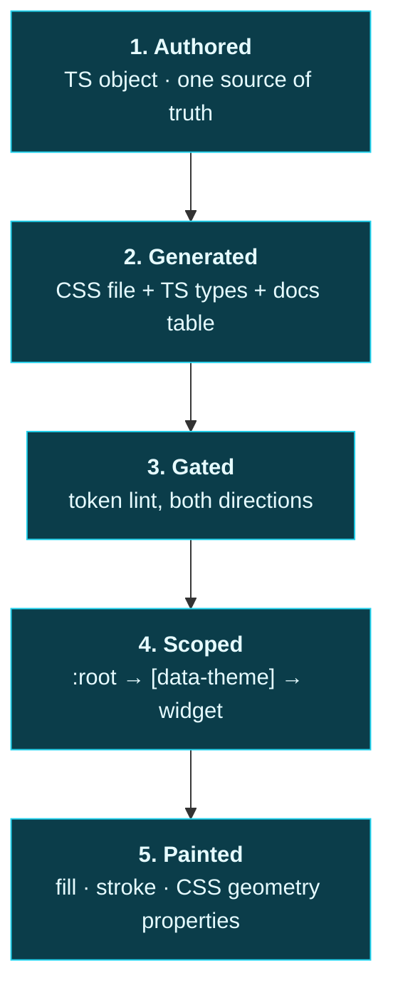

# Map 03 — Token flow

Source: `../20-architecture.md` §3.2 (corrected by `41`); `../41-text-metrics.md` §2, §2.1;
`../42-typography.md`; `../43-theming.md`. Arrows read **"flows into"**.

---

## Two mechanisms, and they never mix

The split is **by consequence, not by token name**. The question is never "is this a font thing or a
colour thing" — it is *"if this value changes, does the layout the server computed become wrong?"*

```mermaid
flowchart TD
    src["<b>Authored source of truth</b><br/>typed TS objects in @gx/tokens"]

    subgraph pres["PRESENTATION — CSS custom properties"]
        p1["--gx-* emitted to a stylesheet"]
        p2["Cascade · :root · [data-theme]<br/>· per-widget scope"]
        p3["Paint"]
        p1 --> p2 --> p3
    end

    subgraph plan["PLAN INPUT — typed TS objects"]
        q1["&lt;GxConfig&gt; provides fitting typography<br/>+ thresholds"]
        q2["PlanPolicy"]
        q3["planChart&#40;&#41;"]
        q4["ChartPlan"]
        q1 --> q2 --> q3 --> q4
    end

    src --> p1
    src --> q1

    p2 -.->|"❌ FORBIDDEN<br/>getComputedStyle does not exist on the server.<br/>Server plan ≠ client plan = <b>hydration mismatch</b>"| q3

    classDef s fill:#2f1b3d,stroke:#c084fc,color:#f6ecff
    classDef pr fill:#3d2a0b,stroke:#fbbf24,color:#fff8e6
    classDef pl fill:#0b3d4a,stroke:#22d3ee,color:#e6fbff
    class src s
    class p1,p2,p3 pr
    class q1,q2,q3,q4 pl
```

**A CSS custom property may never be read as a plan input.** Not via `getComputedStyle`, not via a
`ref`, not "just on the client". The moment one value takes that path, the server and the client
compute different plans and every chart on the page mismatches on hydration.

The rule stated as a test: *if you deleted the entire stylesheet, would `planChart()` still return the
same object?* It must. Anything for which the answer is no belongs on the right-hand track.

---

## The six that travel both ways

These are the exception, and the reason the exception exists is measurement. Changing any one of them
changes glyph **advances**, which changes label widths, which changes the y-gutter, which changes the
plot width. The server has to know them before it can lay anything out.

The direction is one-way and load-bearing: **the CSS is generated *from* the typed object**, never
authored alongside it. Two hand-maintained copies of the same six values is exactly the drift the
corpus keeps warning about, and here the drift is invisible — the chart just renders with labels that
overflow a gutter sized for a different font.

⚠ This corrects `../20-architecture.md:127`, which classed `font-family` as presentation-only. That
was wrong: swapping the family changes every advance in the metrics table.

**`GRAD` is the counter-example that proves the rule.** It stays presentation-only, because it changes
typographic colour without changing advances — so `--gx-label-landmark-grade` may live purely in CSS
and be themed freely. `wght` cannot, which is why `GRAD` supersedes both `landmark-weight` spellings.

---

## From authored value to pixel

Step 5 is where a structural constraint bites, and it is the newest thing in this map:

⚠ **Geometry can only be tokened on elements whose geometry is CSS-settable.** SVG2 exposes
`cx, cy, r, rx, ry, x, y, width, height` as CSS properties, and `d` as well (Chrome 79+, Safari 10.1+,
Firefox 97+). It does **not** expose `x1, y1, x2, y2` on `<line>`, in any browser, with nothing
planned.

So a tick-length or gridline-extent token applied to a `<line>` compiles, ships, passes the token lint
gate, and does nothing. Draw ticks and gridlines as `<path>`. Full record:
[`../decisions/012-no-line-element-for-tokened-geometry.md`](../decisions/012-no-line-element-for-tokened-geometry.md).

---

## The gate, in both directions

The token lint gate is the only thing preventing a slow return to hardcoded values, and a gate that
has never been observed to fail is indistinguishable from a job that exits 0:

| Direction | Asserts | Fails when |
|---|---|---|
| Forward | No package emits a raw hex, `rgb()`, `hsl()`, or `px` literal | Someone hardcodes a value |
| Reverse | A deliberately-planted violation **is** caught | The gate itself has broken |

The allowlist (`../43-theming.md` §6) is small and every entry needs a stated reason. An allowlist that
grows without justification is the gate failing slowly rather than at once.

⚠ **The table above describes four of six rules.** B1 added two that ask a different question, and
neither is about a literal:

| Rule | Asks | Added |
|---|---|---|
| `undefined-token` | Does the token this `var()` names **exist**? | B1 slice 1 |
| `token-name` | Is the token being declared **named the way `raw/06` §6.0 says**? | B1 slice 2 |

They sit at opposite ends of one token's life — the second checks the line that creates a name, the
first every line that reads it — and both run *inside* the allowlisted theme directory, because the
allowlist exempts literals and neither of these is about a literal. `../43-theming.md` §6.1c and §6.1d
carry the full statements.

⚠ **`token-name` enforces a 34-group vocabulary where §6.0 publishes 19**, because §6.2–§6.9 of that
same document specify names using 13 first segments its own closed set omits. The gate takes the union
in use; a **test parses `raw/06` and asserts the union still contains it**, so the discrepancy is
checked rather than merely written down. That test is the reverse direction for this rule: planting a
bad name proves the gate fires, and parsing the specification proves the gate has not drifted from what
it claims to enforce.

---

## Current state of this track

B1 is closed for the shipped presentation surface: the generated source reports 198 declarations,
the Rail and Neutral dark/light themes are emitted from it, and membership, naming, provenance,
and drift gates are green. The earlier 43-name, six-default, and neutral-theme entries were B1
implementation work; they are no longer token-tree blockers. Any remaining research uncertainty is
represented as an explicit implementation tier rather than promoted to external evidence.

B3 is also closed: the responsive threshold surface is a typed `PlanPolicy`, separate from
`PlanOverrides`, and the policy gate checks serialisability, provenance, planner consumption, and
the explicit `@future` marker on thresholds reserved for later chart families.

The next dependency is C1's grid and per-widget sizing. Windows-only Segoe UI Variable measurement
remains a bounded calibration follow-up; the released Roboto Flex behavior and available-face
`safetyFactor: 1.57` are committed, and neither blocks the B3 planner contract.

Roboto Flex was chosen over Inter on two grounds: `opsz` spans 8–144 against Inter's 14–32 — and the
Micro rung lives below 14 — and Inter has no `GRAD` axis at all, which would force the landmark
emphasis back onto `wght` and invalidate the metrics table.
