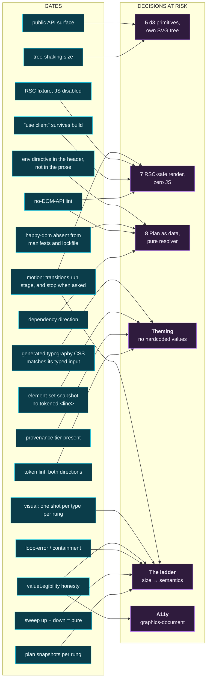
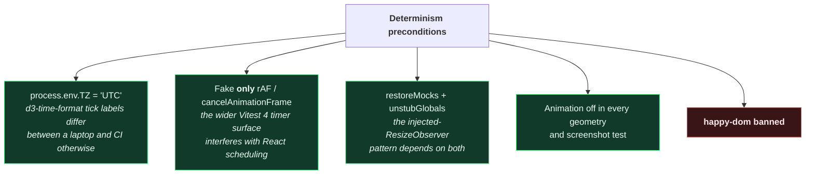

# Map 04 — CI gate map

Source: `../20-architecture.md` §6a–§6g, §7; `../30-implementation-plan.md` A1, A3–A5, B1, B3, E3.

Every gate here exists because a specific decision would otherwise be **unfalsifiable**. That is the
selection criterion: a check that cannot fail in a way that teaches you something is not on this list.

---

## Gate → decision → milestone



Two decisions carry three gates each. That is not redundancy — each gate catches the failure at a
different moment: lint at author time, build assertion at package time, fixture at run time.

⚠ **G18 is deliberately absent from the diagram.** `../60-commercial-model.md` §7 *proposes* it — no
network APIs in any published package — and nothing implements it. Drawing a proposed gate among gates
that run is how a plan becomes a claim. It has a row in the register below, marked as the
proposal it is, because the number is taken and the next gate to be written must not reuse it: that is
exactly why the motion gate is **G19** and not G18
([016](../decisions/016-what-svg-geometry-actually-transitions.md)).

---

## The full register

| # | Gate | Lands | Protects | Fails when |
|---|---|---|---|---|
| G1 | dependency-cruiser: `@gx/core` may not import `react`; only `@gx/react`/`@gx/grid` may be client | **A1** | 8 | Someone reaches for a hook in the resolver |
| G2 | Lint ban on `getBBox`, `getComputedTextLength`, `getTotalLength`, `getBoundingClientRect` inside `@gx/core` | **A1** | 7, 8 | The resolver starts measuring instead of modelling |
| G3 | Grep **built output** for surviving `"use client"` | **A1** (config), **A4** (regression) | 7 | Rolldown bundles a non-entry module and strips the directive |
| G4 | Next.js 16 App Router page rendering `<Chart plan={…}>` in a **server component**, asserting **both**: (1) with `javaScriptEnabled: false` the SVG, a real `<path>` and the accessible title are in the DOM; (2) the **built client JS** contains no chart code | **A4** → landed at **A5**; green, and in CI's `browser` job | 7 | The RSC path silently degrades to SSR + hydration — which assertion 1 alone *cannot see* |
| G5 | Bundle each exported symbol alone; assert the component set equals a known set; print `symmetricDifference` | **A4** | 5, packaging | "Import one chart, ship one chart" stops being true |
| G6 | `ts-morph` walk from `src/index.ts` collecting `missingExports` + `forbiddenExports` | **A4** | 5 | A public prop's type is unnameable by consumers |
| G7 | Token lint — raw colour literals (hex, `rgb()`, `hsl()`, `oklch()`, `lab()`, `hwb()`, `color()`, named), raw length literals, gradients — **planted in both directions: a violation asserted to fail *and* a valid theme file asserted to pass clean** | **A1** (written), **B1** (full tree) | theming | Either someone hardcodes, or the gate itself has broken |
| G8 | Every threshold carries a provenance tier | **B3** | theming | A tuned number acquires the authority of a researched one |
| G9 | Plan snapshots: `(type, size, shape) → plan`, per rung | **A3** | ladder | A rung's semantics change without anyone deciding to change them |
| G10 | Sweep width **up then down** across every boundary; assert the plan is a pure function of size | **A3** | ladder | Hysteresis creeps in — the direction you approached from starts to matter |
| G11 | Drag across every rung boundary; **four** assertions — no loop error; the measured box never moves unprompted; no scrollbar gutter; nothing the plan sizes overflows | **A5**. Green, and in CI's `browser` job. ⚠ Assertion 3 is **inert** on macOS — see below | ladder, containment | Any of the four — and the loop error is the *least* likely of them to fire |
| G12 | `valueLegibility !== 'values'` → `!axes.y.visible` | **A3** | a11y, ladder | The chart claims readable values while showing an axis it cannot support |
| G13 | One screenshot per chart type per rung, pinned Docker, chromium-only, `reducedMotion: 'reduce'` | **D** | ladder | Geometry regresses in a way no assertion names |
| G14 | Element-set snapshot per chart type; no `<line>` may carry `x1`/`y1`/`x2`/`y2` from a `var(--gx-*)` | **A4** | theming | A geometry token ships, is documented, and does nothing ([012](../decisions/012-no-line-element-for-tokened-geometry.md)) |
| G15 | happy-dom absent from every manifest **and** from the lockfile | **A1** | 7, 8, determinism | A transitive dependency reintroduces the shim that answers `getBBox()` with `0` |
| G16 | The Vitest environment directive appears only in a test file's first three lines | **A1** | determinism | A test acquires a DOM from a sentence about DOMs |
| G17 | The committed fitting-typography CSS is regenerated and compared byte-for-byte against its typed plan input | **A4** | theming | The generated stylesheet and the plan it is generated from drift apart |
| G18 | *Proposed, unimplemented* — no network APIs in any published package | — (`../60-commercial-model.md` §7) | trust | "This library never phones home" becomes a claim nobody checks |
| G19 | Drive the real playground in Chromium across a rung change and sample every frame: chrome interpolates, marks interpolate **and lag it by the delay the stylesheet declares**, `prefers-reduced-motion: reduce` suppresses all of it, and the resting state is identical either way | **A6** | 7, ladder | Motion silently stops — a re-key, a collapsed delay, or an inverted media query, none of which any node test can see |
| — | `publint --strict` + `attw`, with the §5.5 CSS-subpath exclusions | **E3** | packaging | The published artefact is broken in a way the repo never is |

**G14 exists because G7 structurally cannot cover it.** G7 checks that a `var()` was used; it has no
way to know whether the property that `var()` lands on exists. `line { y2: var(--gx-tick-length) }`
parses, passes G7, builds, emits no warning, and has no effect — `x1`/`y1`/`x2`/`y2` are not
CSS-settable in any browser. Same species as the happy-dom `0` this project already caught: a thing
that looks like it works and quietly doesn't. Cheap at A4, near-impossible to retrofit once the tokens
are published as working.

**G7's *allow* direction is the one that actually fires.** The reflex is to plant a violation, watch it
fail, and treat the passing side as ceremony. Measured against theme-shaped CSS, the regex script this
gate was assumed to be a port of returned **six rejections of which two were correct** — its failure mode
is rejecting valid CSS, not missing invalid CSS. So the allow side is planted too, with the cases that
broke it: a token definition, a `calc()` multiplier, a unitless `0`, a `currentColor`, and a base64 data
URI. A gate that cries wolf gets switched off, which fails as completely as exiting 0 and is quieter
about it ([015](../decisions/015-token-gate-is-a-parser.md)).

**G16 was not designed; it was discovered failing.** The determinism test asserting `@gx/core` runs
without a DOM went red on its first execution: `globalThis.document` was defined despite
`environment: 'node'`. The cause was a **prose comment** in the test file that mentioned the Vitest
environment directive while explaining when to use it. Vitest matches that directive with a regex over
the whole file, comments included — so the sentence describing the escape hatch *was* the escape hatch.
Measured: 776 ms of jsdom setup versus 0 ms, from one `//` line. Nothing in the output names the
environment, only its duration.

This repo is unusually exposed to that. Its test files quote config keys and token names back at the
reader as documentation, so the failure has a specific shape: a `@gx/core` test *discussing* the
DOM-measurement ban acquires a DOM, and G2's own test begins evaluating in the environment it exists to
prohibit. G16 is therefore stricter than Vitest — the directive is an instruction in the header and
prose everywhere else — because Vitest's own rule cannot tell the two apart.

Same species as G14 and as the happy-dom `0`, arriving through a third door: **a thing that looks like
it works and quietly doesn't.** Worth noting that the same pattern bit twice in one sitting — writing
G16's own source, a literal `*/` inside the phrase "a `/** … */` header" closed its JSDoc block early
and the file stopped parsing. Text quoted as documentation being read as syntax is not a rare accident
in this corpus; it is a standing hazard of documenting mechanisms in the language they operate on.

**G15 is the ban with no lint rule.** happy-dom and jsdom are interchangeable everywhere except the four
APIs this library forbids itself, where jsdom throws and happy-dom returns `0` — the difference between
a failing test with a stack trace and a chart laid out as though every label were empty. Nothing in
source names the shim, so the check is a dependency-graph fact: absent from every manifest *and* from
the lockfile, because a transitive pull is enough for Vitest to resolve `environment: 'happy-dom'` by
name.

**G10 is the one most likely to be dropped as redundant.** It is not. G9 asserts each rung is correct;
G10 asserts the *path between* rungs is memoryless — which is the whole reason `prevClass` was settled
out of the resolver. Without it, someone reintroduces hysteresis as a "small" fix and G9 stays green.

---

## The three browser gates, and what is actually known about each

`../43-theming.md` §6.3 is the standard this section is held to: *"A gate never observed to fail is not
a gate — it is a job that exits 0."* The obvious twin is what governed the G4 entry below while it was
pending — **a map that reports a gate passing before anyone has run it is the same disease with better
manners.** So these three are written apart from the register, because what is *known* about each
differs sharply and the register's one-line rows cannot carry that difference.

They are also the three that need a real Chromium, which is why they share one CI job and stay out of
`pnpm verify`. The reasoning is in `.github/workflows/ci.yml`, not repeated here.

### G11 — green, in CI, and still not clean

`scripts/check-containment.mjs` runs as **`pnpm lint:containment`** and is a step in the `browser` job.
It is deliberately outside `pnpm verify`: it needs a browser binary, and a fresh clone should not open
with a ~150 MB download.

The recorded sweep covers **178 sizes across 13 rung changes** and reports **0 `ResizeObserver` loop
errors** and **0 px unattributed overflow**.

⚠ **"0 px unattributed" is not "0 px", and the difference is a real shortfall, not a rounding
artefact.** Re-observed on 2026-08-24 at A6, unchanged. The same run reports a peak **21 px block-axis overflow** on `.gx-auto-chart`, *attributed*
to `.gx-chart__caption` and therefore exempt: **the `<figcaption>` data table does not fit the box it
is in.** The exemption exists so the gate can be green about the thing it gates — geometry the *plan*
sizes — while still printing the number nobody has fixed. Read a passing G11 run as *"the plan contains
itself; the caption does not,"* and do not cite it as evidence of a clean containment story.

⚠ **Assertion 3 has never actually executed anything.** The scrollbar-gutter check computes
`offsetWidth - clientWidth - borderX`. macOS draws **overlay** scrollbars, which occupy zero layout
space, so that expression is `0` on a developer machine whether or not a scrollbar is present. Every
observation of this gate so far is a macOS observation, which means assertion 3 is currently *inert*
rather than *passing*. CI will run it on Linux, where classic scrollbars take real width — so it may
fire for the first time on a size that has already "passed" 178 times. That is not a prediction of
failure; it is a statement that this assertion has produced no evidence yet and must not be counted as
though it had.

⚠ **Assertion 1 — the loop error — is the weakest of the four, and that was measured rather than
assumed.** Planting the containment rule's exact negation (a content-determined box height, so the
chart sizes the box that measures it) produced a box growing `288 → 844 → 1603 → 2279 → 3038 → 3776 →
4514` px across six frames and never stopping, while Chromium emitted **no** console error, **no**
`pageerror` and **no** loop warning at all. The loop error fires when an observation re-triggers itself
*within one delivery cycle* past the depth limit; a runaway paced one growth per animation frame
delivers cleanly every time and is, to the browser, just a page whose layout keeps changing. A gate
built on assertion 1 alone would have watched the worst containment failure this project can have and
printed `0 loop errors`. **Assertion 2 is what caught it.** The full argument — including why the gate
reads `.gx-auto-chart` rather than `.widget`, after a period in which it was silently grading the wrong
box — is in that script's header, and it is worth reading before trusting any number above.

### G4 — green, and this map has now seen it pass

`scripts/check-rsc.mjs` and its Next.js 16 fixture at `apps/rsc-fixture` landed at A5 and this gate is
a step in the `browser` job. Observed on 2026-08-24: **77 marks in a `role="graphics-document"` `<svg>`
at size class stage, stamped `_S_1_-title` by React's server renderer, and 0 of 6 chart markers found
in 553 KB of client JavaScript across 9 chunks.**

⚠ **The paragraph this replaced said the opposite, and it is worth knowing what it said.** It read
*"Nothing in this subsection is an observation of success, and the row above must not be read as
green"* — written while the gate existed but had never been run here. That is the discipline this
section exists for, and the reason to record the transition rather than quietly overwrite it: the
sentence was correct when written and would have been a lie a week later. The rest of this subsection
is the gate's *design*, which has not changed.

**Why it takes two assertions and not one.** The row this replaced asserted only that the SVG is in the
HTML with JS disabled — and that assertion cannot detect the failure the row names. Turn JavaScript
off and load the page: if `<Chart>` is a genuine server component the SVG is in the HTML, and if
`<Chart>` is a client component rendered on the server and hydrated in the browser the SVG is *also* in
the HTML, because that is precisely what SSR is for. The two architectures G4 exists to tell apart
produce byte-similar first paints. So assertion 1 is satisfied by exactly the degradation the gate was
built to catch, and on its own it is a spelling test for `<svg>` printed in green.

Assertion 2 is the architectural claim: **the client JavaScript the build produced contains no chart
code** — searched for string literals that survive minification, in `.next/static/`, which is compiled
client *code*. ⚠ Not in the HTML: App Router serialises the rendered tree into inline
`self.__next_f.push(…)` scripts, so the chart's class names appear in the document as **data** on a
page that is doing exactly the right thing. A gate grepping the HTML would fail a correct RSC page,
and a gate that fires on success gets deleted rather than fixed. Conversely, assertion 1 is assertion
2's **vacuity check** — a page rendering no chart at all trivially ships no chart code — which is why
neither is meaningful without the other.

⚠ **A prediction this gate made, and got wrong.** G4 was written expecting a red first run:
`packages/primitives/src/Chart.tsx` calls `useId()` and `useMemo()`, and the gate's author believed
React Server Components support neither. **That is false, and the record of the error is kept because
of what disproving it produced.** React 19's `react-server` build exports `useId`, `useMemo` and
`useCallback`; the hooks it replaces with a throwing stub are `useState`, `useEffect`, `useRef`,
`useReducer` and `useLayoutEffect`. `Chart.tsx`'s own docblock and decision 7 both said so, correctly,
and were doubted rather than read. The fixture builds, renders a 7.7 KB `<svg>`, and ships **zero**
`@gx/*` bytes to the client. **Decision 7 stands as written.**

What survives the correction is the reason G4 exists: A4's zero-client-JS proof was a node test
calling `renderToStaticMarkup()` — a *different renderer* on a *different dispatcher*, where all of
those hooks work — so it went green for a milestone without exercising the architecture it was named
after. Same species as G14, G15 and G16: a thing that looks like it works and quietly doesn't. Here it
was the **test** that was hollow, not the code, and only a real App Router build could tell which.

⚠ **Assertion 1b, which came out of disproving the above, and is the strongest thing in this gate.**
The two renderers stamp different infixes into `useId()`: the RSC Flight server composes
`'_' + prefix + 'S_' + n.toString(32) + '_'` — **S for Server** — while `react-dom`'s SSR renderer uses
`R_` in the same position. `<Chart>` feeds `useId()` into `aria-labelledby`, so **the winning
renderer's initial is in an attribute of the shipped HTML**. That is a *positive* reading of which
renderer ran, which is exactly what the paragraphs above say a first-paint assertion cannot give you —
an `_R_` id is SSR-degradation caught in the act, no bundle scan required. It works only because the
fixture passes no `id` prop (`<Chart>` reads `id ?? useId()`, so supplying one discards the generated
value). It is a React internal with no public promise behind it, so the gate fails both on seeing `R_`
**and** on recognising neither infix — a discriminator that quietly stopped discriminating would be
this repository's own named failure species, committed by the gate built to catch it.

### G19 — green, and observed failing three ways on purpose

`scripts/check-motion.mjs` runs as **`pnpm lint:motion`** and is the third step in the `browser` job.
Observed on 2026-08-24, resizing 900×520 → 560×380: **chrome left at 26 ms, marks at 526 ms — a 500 ms
gap against 500 ms declared, 0.50 of the recompose duration, over 108 sampled frames**, with 108 frames
under `reducedMotion: 'reduce'` and not one of them between the endpoints.

⚠ **It is the only gate that can see A6 at all.** A transition is not a property of markup — it is an
engine interpolating between two computed values over time — and jsdom has neither interpolation nor a
clock. `identity.test.tsx` proves the DOM nodes survive a resize (A6's *precondition*) and
`Chart.test.tsx` proves the plan's motion facts reach the figure (A6's *wiring*); the entire motion
block of `chart.css` could be deleted and all 605 node tests would stay green.

⚠ **It drives the playground, not a fixture.** A gate that builds its own
`<rect class="gx-grid__line">` asserts that a stylesheet animates a string the gate itself wrote, and
stays green through a rename, a restructure, or a `<Grid>` that stops emitting gridlines. So: the real
dev server, the real `<AutoChart>`, the real stylesheet, resized the way a user resizes it.

**Three regressions were planted and all three were caught** — the §6.3 standard, discharged rather
than asserted:

| Planted | Reported |
|---|---|
| `<Grid>` re-keyed by `tick.offset` | *"the gridline snapped: no sampled frame sat between the start and final `y`"* |
| `@media (prefers-reduced-motion: no-preference)` → `@media all` | *"reduce still animated gridY (saw 478.258px at 27ms)"* |
| `--gx-motion-stage-delay` derived once on `:root` | *"the delay is 150ms against a 1000ms recompose duration — under 0.25 of it"* |

⚠ **The third of those is the reason this gate has two staging assertions instead of one, and the
first version would have missed it.** The obvious check is *observed gap ≈ declared delay*, and it
catches the stylesheet failing to reach the DOM. It cannot catch the delay being declared *wrongly*,
because observed and declared then collapse together and agree: the planted version reported *"a 150ms
gap against 150ms declared"* and exited 0 — consistent, and wrong by a factor of three. So the delay is
also checked as a **fraction of the duration in effect**, with a lower bound rather than the `/ 2` the
tokens use, because `theme.css` marks that fraction UNVERIFIED and hands it to B1.

⚠ **Two bugs in the implementation were found by this gate before it ever ran green,** and both were in
A6's own work rather than in the harness. The stage delay was written
`calc(var(--gx-motion-duration) / 2)` on `:root`; a custom property is substituted where it is
*declared*, so it resolved against the root (rescale) duration and inherited down already computed,
giving every recompose figure a 150 ms delay behind a 1000 ms move. And the gate's own settle-at-start
was 600 ms against a 1150 ms envelope, so the first sampled frames of each run were the *previous*
transition still in flight — which the gate reported as *"the marks left before the chrome"*, an
inverted-staging failure about a transition that had not started.

---

## ⚠ The gate scripts are the least-checked code in the repository

Recorded because it is the reason two type errors sat in `scripts/` undetected, and because it makes
every claim above weaker than it looks.

`pnpm typecheck` is `turbo run typecheck`, which runs the **per-package** `tsconfig.json` files.
`scripts/**` is covered by the **root** `tsconfig.json` — the one carrying `allowJs` + `checkJs`, which
is what makes the JSDoc annotations in these plain-JS gates load-bearing rather than decorative — and
that config is in no turbo pipeline and in no step of `pnpm verify`. So the whole-repo typecheck comes
back green while the gate scripts are never checked at all.

The command that actually reveals them:

```bash
pnpm exec tsc --noEmit -p tsconfig.json
```

Two `TS2538`s in `scripts/generate-typography-css.mjs` were found and fixed this way. Others remain
in the two browser gates, most of them benign by construction — `document`, `getComputedStyle` and
`requestAnimationFrame` appear in functions that are *serialised and evaluated inside Chromium*, so
they are correctly absent from a `lib: ["ES2022"]` Node program and the error is the checker being
right about the wrong file.

⚠ **The inversion is the point, and it is not a small one.** These scripts are the things that enforce
decisions 5, 7, 8 and the theming contract across the whole tree. They are the least-verified code in
the repository, which means a gate can be subtly broken in exactly the way it exists to prevent and
nothing will say so. Not fixed here: wiring the root config into `verify` surfaces a pile of unrelated
in-flight errors and needs to happen as its own deliberate change, with the browser-only globals given
a home rather than suppressed.

---

## Determinism is a prerequisite, not a gate

None of the above is trustworthy without these. They belong in A1's config, before the first test:



⚠ **The happy-dom ban is the highest-leverage line in the whole test config.** It returns `0` from
`getComputedTextLength()`, `getBBox()` and `getTotalLength()`, and its `ResizeObserver` exists but
never fires — not even the initial observation a real browser delivers on `observe()`. A collision
routine asking *"does this label fit?"* gets `0` and concludes **yes, always**. Every label test then
passes forever, including the ones that visibly collide. jsdom throws instead, which is strictly
better: you cannot ship a false green.

This is confirmed by design, not a gap awaiting a fix — jsdom's README lists layout as a permanent
non-goal, jsdom 30.0.1 has zero files matching `resizeobserver`, and `SVGGraphicsElement.webidl` has
every geometry method commented out.

---

## Where the weight actually sits

The tiers, ordered by how much they prove per unit of cost:

| Tier | Environment | Carries |
|---|---|---|
| `planChart()` + ladder | **Bare Node, no DOM at all** | Most of the suite. The ladder *is* this tier. |
| `@gx/primitives` render-to-string | Node | Structure + token usage. Hook-free, so no client runtime. |
| `@gx/react` | jsdom + **our** `FakeResizeObserver` | Rung transitions, driven by `emit(w, h)` |
| Real measurement + interaction | Vitest browser mode, Playwright provider | Smallest tier |
| Visual | Pinned Docker, chromium-only | Bounded, deliberate set |

The inversion is the point: the most valuable tier is the one with no browser in it. That is decision
8 paying for itself — *a pure function returning a plain object is the most testable artefact
available*, which is also why d3-shape (no DOM at all) leads every library surveyed on
geometry-assertion density.

**Resize is an input we control, not an event we wait for.** ~50 lines of `FakeResizeObserver` with an
`emit()` driver replaces the entire polyfill question; the registry offers nothing with a 2026 release
anyway.

⚠ **The signature settled at `emit(width, height, options?)`, not the positional `emit(el, w, h)`
this map carried through A4.** The sketch in `../raw/07-arch-oss-packaging.md` §6.2 is right about the
capability and wrong about the ergonomics: one observer per widget is the depth-ordered pattern the
`ResizeObserver` spec is designed around (`../raw/05-theory-responsive-viz.md` §5.3), so *almost every*
call site in this tier observes exactly one element and would have had to name it on every line. The
element moved into an optional `target` field, which keeps the common call at `emit(320, 180)` and
still leaves the multi-target case sayable. `packages/testing/src/index.ts` is the signature of record.

⚠ **This tier was a false green until A5, and it belongs in a map about what each tier proves.** The
fake's entry originally carried `contentRect` alone. Real consumers — `@gx/react`'s `useElementSize`
among them — read `contentBoxSize[0]` first and fall back to `contentRect` only when it is absent, so
every fake-driven test in this tier was exercising a branch **no real browser takes**: full green over
code nobody runs. `contentRect` also reports the *transformed* box, so a chart inside a CSS
`scale(0.5)` is reported at its apparent size and planned for a rung it does not occupy. The entry now
carries both boxes, derived from the same numbers so they cannot disagree with each other, and the
legacy shape is reachable only on request as `emit(w, h, { legacy: true })` — kept covered rather than
merely unreachable, because Safari before 15.4 and every `contentRect`-only polyfill still in the
registry are real places that branch runs. Never the default again.

---

## Accessibility: two gates, not a suite

`../20-architecture.md` §7 establishes that only **2 of axe's 105 rules** apply to an SVG chart, so
`vitest-axe` is abandoned — running 105 rules to exercise 2 produces confidence, not coverage.

What is checked instead:

1. The `<svg>` carries `role="graphics-document"` and **never `role="img"`**. `role="img"` triggers
   Children Presentational True, which erases the `<figcaption>` data table from the accessibility
   tree entirely — the chart becomes a single opaque image with a label.
2. G12, above: the plan may not claim readable values it cannot deliver.

Plus one structural check that pays off twice: the visual tier sets `reducedMotion: 'reduce'` on the
browser context, which doubles as the §7 reduced-motion verification. Note the polarity being verified
— animation is opted *into* via `@media (prefers-reduced-motion: no-preference)`, so "reduce" must
produce a **still** chart, not a differently-animated one.

---

## The two gates almost no library builds

G5 and G6 are worth calling out separately because they run in the **`node`** environment against the
*published artefact* rather than the source tree. Both come straight off the product pitch:

- **Tree-shaking as an enforced test** converts *"import one chart, ship one chart"* from a marketing
  line into something that can fail in CI.
- **Public-API surface as an enforced test** prevents the commonest `.d.ts` papercut — a prop whose
  type consumers cannot name.

They are also the two gates that justify the subpath-export decision in
[`00-system-map.md`](00-system-map.md): per-type packages were rejected in favour of `/line`, `/bar`,
`/donut` subpaths on one `@gx/primitives`, and that trade is only safe **because it is measured**.
Revisit it only if G5's numbers say otherwise.
