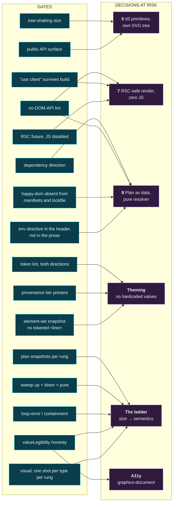
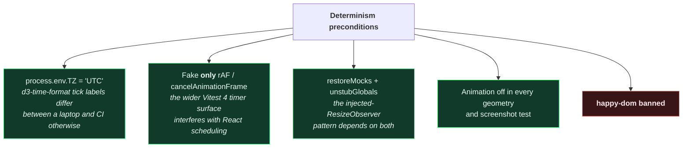

# Map 04 — CI gate map

Source: `../20-architecture.md` §6a–§6g, §7; `../30-implementation-plan.md` A1, A3–A5, B1, B3, E3.

Every gate here exists because a specific decision would otherwise be **unfalsifiable**. That is the
selection criterion: a check that cannot fail in a way that teaches you something is not on this list.

---

## Gate → decision → milestone

Two decisions carry three gates each. That is not redundancy — each gate catches the failure at a
different moment: lint at author time, build assertion at package time, fixture at run time.

---

## The full register

| # | Gate | Lands | Protects | Fails when |
|---|---|---|---|---|
| G1 | dependency-cruiser: `@gx/core` may not import `react`; only `@gx/react`/`@gx/grid` may be client | **A1** | 8 | Someone reaches for a hook in the resolver |
| G2 | Lint ban on `getBBox`, `getComputedTextLength`, `getTotalLength`, `getBoundingClientRect` inside `@gx/core` | **A1** | 7, 8 | The resolver starts measuring instead of modelling |
| G3 | Grep **built output** for surviving `"use client"` | **A1** (config), **A4** (regression) | 7 | Rolldown bundles a non-entry module and strips the directive |
| G4 | Next.js App Router page rendering `<Chart plan={…}>` in a **server component with JS disabled**, asserting the SVG is in the HTML | **A4** | 7 | The RSC path silently degrades to SSR + hydration |
| G5 | Bundle each exported symbol alone; assert the component set equals a known set; print `symmetricDifference` | **A4** | 5, packaging | "Import one chart, ship one chart" stops being true |
| G6 | `ts-morph` walk from `src/index.ts` collecting `missingExports` + `forbiddenExports` | **A4** | 5 | A public prop's type is unnameable by consumers |
| G7 | Token lint — raw colour literals (hex, `rgb()`, `hsl()`, `oklch()`, `lab()`, `hwb()`, `color()`, named), raw length literals, gradients — **planted in both directions: a violation asserted to fail *and* a valid theme file asserted to pass clean** | **A1** (written), **B1** (full tree) | theming | Either someone hardcodes, or the gate itself has broken |
| G8 | Every threshold carries a provenance tier | **B3** | theming | A tuned number acquires the authority of a researched one |
| G9 | Plan snapshots: `(type, size, shape) → plan`, per rung | **A3** | ladder | A rung's semantics change without anyone deciding to change them |
| G10 | Sweep width **up then down** across every boundary; assert the plan is a pure function of size | **A3** | ladder | Hysteresis creeps in — the direction you approached from starts to matter |
| G11 | Drag across every rung boundary; assert no plan field alters the measured box | **A5** | ladder, containment | The infinite `ResizeObserver` loop |
| G12 | `valueLegibility !== 'values'` → `!axes.y.visible` | **A3** | a11y, ladder | The chart claims readable values while showing an axis it cannot support |
| G13 | One screenshot per chart type per rung, pinned Docker, chromium-only, `reducedMotion: 'reduce'` | **D** | ladder | Geometry regresses in a way no assertion names |
| G14 | Element-set snapshot per chart type; no `<line>` may carry `x1`/`y1`/`x2`/`y2` from a `var(--gx-*)` | **A4** | theming | A geometry token ships, is documented, and does nothing ([012](../decisions/012-no-line-element-for-tokened-geometry.md)) |
| G15 | happy-dom absent from every manifest **and** from the lockfile | **A1** | 7, 8, determinism | A transitive dependency reintroduces the shim that answers `getBBox()` with `0` |
| G16 | The Vitest environment directive appears only in a test file's first three lines | **A1** | determinism | A test acquires a DOM from a sentence about DOMs |
| — | `publint --strict` + `attw`, with the §5.5 CSS-subpath exclusions | **E3** | packaging | The published artefact is broken in a way the repo never is |

**G14 exists because G7 structurally cannot cover it.** G7 checks that a `var()` was used; it has no
way to know whether the property that `var()` lands on exists. `line { y2: var(--gx-tick-length) }`
parses, passes G7, builds, emits no warning, and has no effect — `x1`/`y1`/`x2`/`y2` are not
CSS-settable in any browser. Same species as the happy-dom `0` this project already caught: a thing
that looks like it works and quietly doesn't. Cheap at A4, near-impossible to retrofit once the tokens
are published as working.

**G7's *allow* direction is the one that actually fires.** The reflex is to plant a violation, watch it
fail, and treat the passing side as ceremony. Measured against theme-shaped CSS, the regex script this
gate was assumed to be a port of returned **six rejections of which two were correct** — its failure mode
is rejecting valid CSS, not missing invalid CSS. So the allow side is planted too, with the cases that
broke it: a token definition, a `calc()` multiplier, a unitless `0`, a `currentColor`, and a base64 data
URI. A gate that cries wolf gets switched off, which fails as completely as exiting 0 and is quieter
about it ([015](../decisions/015-token-gate-is-a-parser.md)).

**G16 was not designed; it was discovered failing.** The determinism test asserting `@gx/core` runs
without a DOM went red on its first execution: `globalThis.document` was defined despite
`environment: 'node'`. The cause was a **prose comment** in the test file that mentioned the Vitest
environment directive while explaining when to use it. Vitest matches that directive with a regex over
the whole file, comments included — so the sentence describing the escape hatch *was* the escape hatch.
Measured: 776 ms of jsdom setup versus 0 ms, from one `//` line. Nothing in the output names the
environment, only its duration.

This repo is unusually exposed to that. Its test files quote config keys and token names back at the
reader as documentation, so the failure has a specific shape: a `@gx/core` test *discussing* the
DOM-measurement ban acquires a DOM, and G2's own test begins evaluating in the environment it exists to
prohibit. G16 is therefore stricter than Vitest — the directive is an instruction in the header and
prose everywhere else — because Vitest's own rule cannot tell the two apart.

Same species as G14 and as the happy-dom `0`, arriving through a third door: **a thing that looks like
it works and quietly doesn't.** Worth noting that the same pattern bit twice in one sitting — writing
G16's own source, a literal `*/` inside the phrase "a `/** … */` header" closed its JSDoc block early
and the file stopped parsing. Text quoted as documentation being read as syntax is not a rare accident
in this corpus; it is a standing hazard of documenting mechanisms in the language they operate on.

**G15 is the ban with no lint rule.** happy-dom and jsdom are interchangeable everywhere except the four
APIs this library forbids itself, where jsdom throws and happy-dom returns `0` — the difference between
a failing test with a stack trace and a chart laid out as though every label were empty. Nothing in
source names the shim, so the check is a dependency-graph fact: absent from every manifest *and* from
the lockfile, because a transitive pull is enough for Vitest to resolve `environment: 'happy-dom'` by
name.

**G10 is the one most likely to be dropped as redundant.** It is not. G9 asserts each rung is correct;
G10 asserts the *path between* rungs is memoryless — which is the whole reason `prevClass` was settled
out of the resolver. Without it, someone reintroduces hysteresis as a "small" fix and G9 stays green.

---

## Determinism is a prerequisite, not a gate

None of the above is trustworthy without these. They belong in A1's config, before the first test:

⚠ **The happy-dom ban is the highest-leverage line in the whole test config.** It returns `0` from
`getComputedTextLength()`, `getBBox()` and `getTotalLength()`, and its `ResizeObserver` exists but
never fires — not even the initial observation a real browser delivers on `observe()`. A collision
routine asking *"does this label fit?"* gets `0` and concludes **yes, always**. Every label test then
passes forever, including the ones that visibly collide. jsdom throws instead, which is strictly
better: you cannot ship a false green.

This is confirmed by design, not a gap awaiting a fix — jsdom's README lists layout as a permanent
non-goal, jsdom 30.0.1 has zero files matching `resizeobserver`, and `SVGGraphicsElement.webidl` has
every geometry method commented out.

---

## Where the weight actually sits

The tiers, ordered by how much they prove per unit of cost:

| Tier | Environment | Carries |
|---|---|---|
| `planChart()` + ladder | **Bare Node, no DOM at all** | Most of the suite. The ladder *is* this tier. |
| `@gx/primitives` render-to-string | Node | Structure + token usage. Hook-free, so no client runtime. |
| `@gx/react` | jsdom + **our** `FakeResizeObserver` | Rung transitions, driven by `emit(el, w, h)` |
| Real measurement + interaction | Vitest browser mode, Playwright provider | Smallest tier |
| Visual | Pinned Docker, chromium-only | Bounded, deliberate set |

The inversion is the point: the most valuable tier is the one with no browser in it. That is decision
8 paying for itself — *a pure function returning a plain object is the most testable artefact
available*, which is also why d3-shape (no DOM at all) leads every library surveyed on
geometry-assertion density.

**Resize is an input we control, not an event we wait for.** ~20 lines of `FakeResizeObserver` with an
`emit()` driver replaces the entire polyfill question; the registry offers nothing with a 2026 release
anyway.

---

## Accessibility: two gates, not a suite

`../20-architecture.md` §7 establishes that only **2 of axe's 105 rules** apply to an SVG chart, so
`vitest-axe` is abandoned — running 105 rules to exercise 2 produces confidence, not coverage.

What is checked instead:

1. The `<svg>` carries `role="graphics-document"` and **never `role="img"`**. `role="img"` triggers
   Children Presentational True, which erases the `<figcaption>` data table from the accessibility
   tree entirely — the chart becomes a single opaque image with a label.
2. G12, above: the plan may not claim readable values it cannot deliver.

Plus one structural check that pays off twice: the visual tier sets `reducedMotion: 'reduce'` on the
browser context, which doubles as the §7 reduced-motion verification. Note the polarity being verified
— animation is opted *into* via `@media (prefers-reduced-motion: no-preference)`, so "reduce" must
produce a **still** chart, not a differently-animated one.

---

## The two gates almost no library builds

G5 and G6 are worth calling out separately because they run in the **`node`** environment against the
*published artefact* rather than the source tree. Both come straight off the product pitch:

- **Tree-shaking as an enforced test** converts *"import one chart, ship one chart"* from a marketing
  line into something that can fail in CI.
- **Public-API surface as an enforced test** prevents the commonest `.d.ts` papercut — a prop whose
  type consumers cannot name.

They are also the two gates that justify the subpath-export decision in
[`00-system-map.md`](00-system-map.md): per-type packages were rejected in favour of `/line`, `/bar`,
`/donut` subpaths on one `@gx/primitives`, and that trade is only safe **because it is measured**.
Revisit it only if G5's numbers say otherwise.
